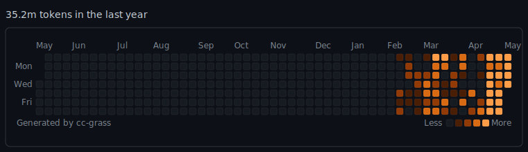

# cc-grass

> Claude Code 사용량을 **오렌지색 GitHub 잔디**로 그려주는 CLI. `~/.claude/projects/**/*.jsonl`을 직접 읽어서 프로필 README에 붙일 수 있는 SVG를 뽑아냅니다.

[English](./README.md) · [简体中文](./README.zh-CN.md) · [日本語](./README.ja.md)

<p align="center">
  
</p>

## 이게 뭐죠

Claude Code의 `/usage > Stats` 화면에는 이미 GitHub 스타일 잔디 그래프가 있지만, 터미널 안에 갇혀 있죠. **cc-grass**는 같은 데이터를 읽어서 GitHub contribution graph와 픽셀 단위로 똑같은 레이아웃의 SVG로 뽑아냅니다. 색깔만 오렌지. GitHub 프로필 README, 포트폴리오 사이트, 어디든 붙이세요.

- **의존성 0개.** `fs` / `path` / `os`만 사용. `ccusage`도 API 호출도 없음.
- **크로스 플랫폼.** macOS / Linux / Windows, Node ≥ 18.
- **SVG만 출력.** 데몬도 크론도 GitHub Actions 템플릿도 안 끼워넣음. 실행 빈도는 사용자가 결정.
- **GitHub 잔디 픽셀 단위 복원.** 10×10 셀, 3px 간격, 라운드 코너, Mon/Wed/Fri 라벨, 월 헤더, *Less / More* 범례.
- **`/usage` 와 숫자 일치.** 토큰 계산은 `/usage > Stats`와 완전히 동일한 식 (`input + output`, cache 제외, subagent 제외).

## 빠르게 시작

```bash
# 파일로 저장
npx cc-grass --output grass.svg

# stdout으로
npx cc-grass > grass.svg

# 인터랙티브 HTML (실제 브라우저에서 hover 작동)
npx cc-grass --html --output grass.html
```

README에 붙이기:

```md

```

## 옵션

| 옵션 | 기본값 | 설명 |
|---|---|---|
| `--metric <prompts\|sessions\|tokens>` | `tokens` | 하루치로 무엇을 셀지 |
| `--output <path>`, `-o` | stdout | 파일로 저장 |
| `--since <YYYY-MM-DD>` | 364일 전 | 시작 날짜 (로컬 시간) |
| `--until <YYYY-MM-DD>` | 오늘 | 끝 날짜 (포함) |
| `--theme <dark\|light>` | `dark` | 테마 |
| `--header <string>` | 자동 | 헤더 텍스트 덮어쓰기 |
| `--claude-dir <path>` | `~/.claude` | Claude Code 데이터 디렉토리 지정 |
| `--include-subagents` | off | subagent jsonl 도 합산 (숫자가 커집니다) |
| `--html` | off | hover tooltip이 작동하는 최소 HTML 페이지로 출력 |
| `--version`, `-v` | — | 버전 출력 |
| `--help`, `-h` | — | 도움말 |

## 예제

```bash
# 최근 30일
npx cc-grass --since 2026-04-06 --until 2026-05-06 -o month.svg

# 토큰 대신 프롬프트 횟수
npx cc-grass --metric prompts -o prompts.svg

# 라이트 테마
npx cc-grass --theme light -o grass-light.svg

# subagent 포함
npx cc-grass --include-subagents -o grass-with-subs.svg
```

## Hover tooltip과 GitHub README 제약

각 셀에는 `<title>1,234 tokens on May 6th.</title>`이 들어 있어서, SVG를 브라우저에서 직접 열거나 `--html` 결과를 열면 hover로 날짜와 토큰 수가 보입니다. **하지만 GitHub README에 붙인 경우에는 작동하지 않습니다** — GitHub은 SVG를 ``로 렌더링하기 때문에, 브라우저는 그 안의 `<title>`을 읽지 않습니다. 이것은 cc-grass의 버그가 아니라 웹 플랫폼의 근본적인 제약입니다. `<title>`은 스크린 리더와 SVG 단독 보기에는 여전히 유용합니다.

hover가 꼭 필요하면 `--html` 출력을 GitHub Pages에 호스팅하고 README에서 링크로 연결하세요.

## 자동 업데이트

cc-grass는 일부러 스케줄러를 내장하지 않습니다. 편한 방법으로:

```bash
# crontab: 매시간 실행하고 변화가 있으면 commit + push
0 * * * * cd ~/profile-repo && npx -y cc-grass -o grass.svg && \
  git add grass.svg && git diff --cached --quiet || \
  (git commit -m "update cc-grass" && git push)
```

GitHub Actions의 `workflow_dispatch`를 로컬에서 트리거하거나, profile repo에 다른 걸 커밋하기 전에 손으로 실행하거나, 자유롭게.

## 토큰 계산식

하루치 `tokens` = 그 날 (로컬 시간) 각 항목의 `message.usage.input_tokens` + `message.usage.output_tokens` 합. Claude Code의 `/usage > Stats > Overview`에 표시되는 `Total tokens`와 같은 식입니다. `cache_read_input_tokens`와 `cache_creation_input_tokens`는 기본 제외. `--include-subagents`를 붙이면 subagent 분량이 더해지지만, 그 외에는 `/usage` 숫자와 일치합니다.

`--metric prompts`는 `type:"user"`이면서 `content`가 실제 사람 프롬프트인 (tool_result가 아닌) 항목만 카운트합니다. `--metric sessions`는 그 날 활동이 있었던 jsonl 파일 수.

## 프로그래밍 API

```ts
import { parseClaudeProjects, renderSvg } from "cc-grass";

const data = await parseClaudeProjects({ includeSubagents: false });
const svg = renderSvg({
  buckets: data.buckets,
  metric: "tokens",
  since: new Date(Date.now() - 364 * 86_400_000),
  until: new Date(),
  total: data.total,
});
console.log(svg);
```

## License

[MIT](./LICENSE) © chuqk
